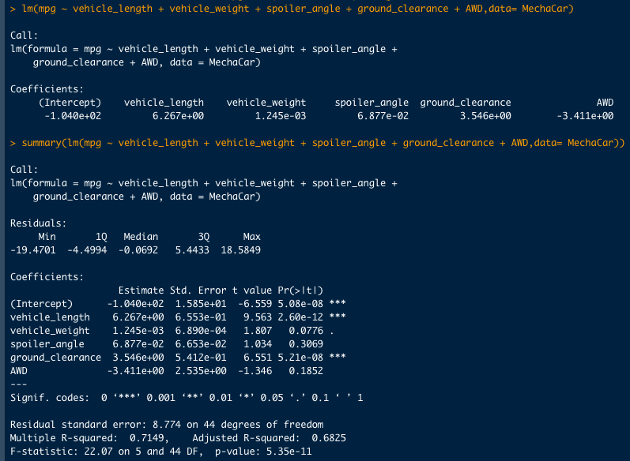
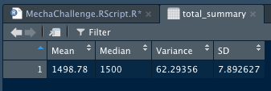
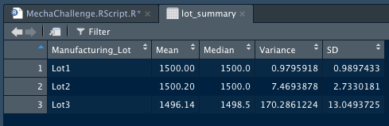
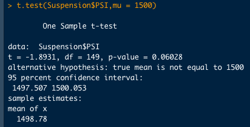
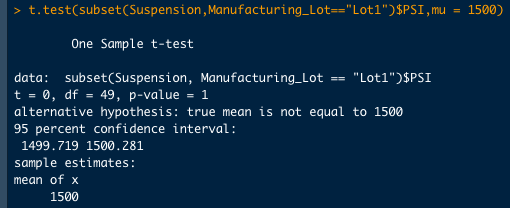
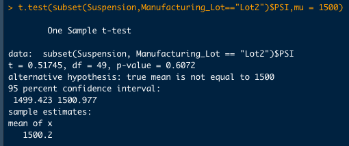
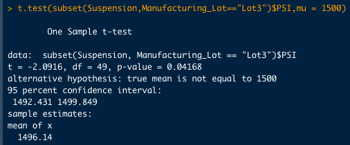

# MechaCar_Statistical_Analysis

## Linear Regression to Predict MPG

-	Which variables/coefficients provided a non-random amount of variance to the mpg values in the dataset?

The variables/coefficients that provided a non-random amount of variance to the mpg values in the dataset were the vehicles length and vehicles ground clearance.  That is to say, the vehicles length and vehicles ground clearance have a significant impact on miles per gallon (MPG) on the MechaCar prototype.  The vehicles weight, spoiler angle and all-wheel drive (AWD) had a random amount of variance with the dataset.

-	Is the slope of the linear model considered to be zero? Why or why not?

The p-value from this dataset is 5.35e-11, is much smaller than the significance level that we’ve been using of 0.05% so we can reject our null hypothesis.  This indicates that the slope from this linear model is not zero.

-	Does this linear model predict mpg of MechaCar prototypes effectively? Why or why not?

The r-squared value from this linear model is 0.7149, or ~71%.  This means that about 71% of MPG predictions can be determined from this model so this modal does predict MPG of MechaCar prototypes effectivity.

## Summary Statistics on Suspension Coils

-	The design specifications for the MechaCar suspension coils dictate that the variance of the suspension coils must not exceed 100 pounds per square inch (PSI). Does the current manufacturing data meet this design specification for all manufacturing lots in total and each lot individually? Why or why not?

Examining our Suspension Total Summary, which takes into account all manufacturing lots, the variance for the coils is 62.29356 PSI.  This is well under the MechaCar suspension coils requirement of under 100 PSI.

Taking a deeper drive and looking at each manufacturing lot individually, I noticed that Lot 1 (0.9795918 PSI) and Lot 2 (7.4693878 PSI) are well under the MechaCar suspension coils requirement of 100 PSI and have relatively low standard deviation.  But, Lot 3 has variance of 170.2861224 PSI which is well over the MechaCar suspension coils requirement of 100 PSI and a relatively high standard deviation.  This indicates to me that Lot 3 is causing variance in the Suspension Total Summary which accounts for all lots and Lot 3 clearly does not meet the design specification for the MechaCar suspension coils.

## T-Tests on Suspension Coils

### All Lots Analysis

Looking at the t-test that included all lots, the mean from the dataset is 1498.78 with a p-value of 0.06028.  Using the significance level that we’ve been using of 0.05%, there is not enough evidence to reject the null hypothesis.

### Lot 1 Analysis

Lot 1 has a mean of 1500 and a p-value of 1.  As a result, we cannot reject the null hypothesis that there is no statistical difference between the observed sample mean and the presumed population mean (1500).

### Lot 2 Analysis

Lot 2 has similar values as Lot 1.  Lot 2 has a mean of 1500.2 and a p-value of 0.6072.  As a result, we cannot reject the null hypothesis that there is no statistical difference between the observed sample mean and the presumed population mean (1500).

### Lot 3 Analysis

On the other hand, Lot 3 has a mean of 1496.14 and a p-value of 0.04168, which is lower than the significance level that we’ve been using of 0.05%.  As a result, we can reject the null hypothesis that there is no statistical difference between the observed sample mean and the presumed population mean (1500).

## Study Design: MechaCar vs Competition

A study that I would recommend MechaCar to pursue is to use different car categories (SUV, sports car, pickups trucks and mid-size crossovers) as the dependent variable of MPG across the difference car categories.  Using an ANOVA test, which is used to compare the means of a continuous numerical variable across a number of groups (or factors in R), we can compare against the competition to convince the consumer that there is a statistical difference between MechaCar and Non-MechaCar products when it comes to MPG for different categories. 

To perform this study, we would need to break out the MPG MechaCar data by the different car categories, as well as, corresponding data from the competition.  Ideally, we would want to reject the null hypothesis that there is not a statistical difference between MechaCar products and Non-MechaCar products and accept our alternative hypothesis that there is a statistical difference between MechaCar products and Non-MechaCar products.  The ANOVA test will naturally test individual car categories so in the case that some car categories do not reject the null hypothesis (that there is not a statistical difference between the two groups), we would want to exclude those categories from our presentation to the clients because it would not help support our case.
